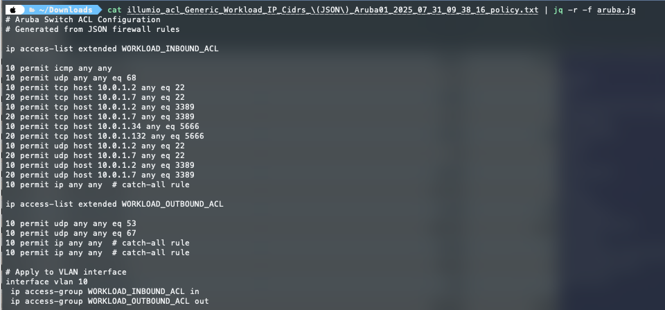

# Illumio NEN to Aruba ACL Converter

This tool converts JSON firewall rules from Illumio NEN (Network Enforcement Node) format into Aruba switch ACL configurations.



## Files

- `aruba.jq` - jq script that transforms JSON firewall rules into Aruba ACL configuration
- `example-nen-output.json` - Sample input file with workload firewall rules

## Usage

```bash
jq -r -f aruba.jq example-nen-output.json
```

## Input Format

The JSON input should contain an array of workloads with:
- `name` - Workload identifier
- `href` - Reference URL
- `rules` - Object containing `Inbound` and `Outbound` rule arrays

Each rule contains:
- `action` - "permit" or "deny"
- `protocol` - Protocol number ("1" for ICMP, "6" for TCP, "17" for UDP, "*" for any)
- `port` - Port number or "*" for any port
- `ips` - Array of IP addresses/CIDR blocks or ["*"] for any

## Output

Generates Aruba switch configuration with:
- Extended ACLs for inbound and outbound traffic
- Sequenced rules (numbered in increments of 10)
- Protocol name translation (ICMP, TCP, UDP)
- IP address formatting (host entries for /32 networks)
- VLAN interface application (VLAN 10 by default)

## Example Output

```
# Aruba Switch ACL Configuration
# Generated from JSON firewall rules

ip access-list extended WORKLOAD_INBOUND_ACL

10 permit icmp any any  # catch-all rule
20 permit udp any any eq 68
30 permit tcp host 10.0.1.2 any eq 22
40 permit tcp host 10.0.1.7 any eq 22

ip access-list extended WORKLOAD_OUTBOUND_ACL

10 permit udp any any eq 53
20 permit udp any any eq 67

# Apply to VLAN interface
interface vlan 10
 ip access-group WORKLOAD_INBOUND_ACL in
 ip access-group WORKLOAD_OUTBOUND_ACL out
```

The script processes only the first workload in the JSON array and creates separate ACLs for inbound and outbound traffic rules.
